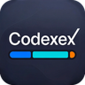
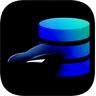
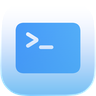

# Magrathean UK

Practical AI adoption, Microsoft 365 cleanup, security work, and shipped software.

Magrathean UK builds small, direct systems for teams that need useful AI, cleaner Microsoft 365 estates, local-first apps, and operator-owned infrastructure. The public work here is the visible edge of a wider product stack across Apple platforms, Android, Linux operations, tenant audit evidence, App Store automation, and local-first data workflows.

## Company

- [Magrathean UK](https://magrathean.uk) - company site and software catalogue.
- [AI Adoption](https://magrathean.uk/ai/) - repo-aware and terminal-aware agent workflows for real teams.
- [IT Consultancy](https://magrathean.uk/it/) - Microsoft 365 security cleanup, identity, devices, endpoint control, and Cyber Essentials Plus readiness.
- [Contact](https://magrathean.uk/contact/) - direct project and consultancy enquiries.

## Product Sites

-  **[Auditex](https://auditex.hu)** - open-source Python CLI and MCP toolkit for local Microsoft 365 and Google Workspace tenant audit evidence.
-  **[Codexex](https://codexex.eu)** - Codex and Spark quota tracking on Mac, iPhone, and iPad.
-  **[Teslatlas](https://teslatlas.eu)** - local-first TeslaMate analytics, route replay, charge diagnostics, and battery insight.
-  **[Termex](https://termexapp.eu)** - tmux-backed SSH, SFTP transfer, jump hosts, port forwarding, and session continuity.
-  **[Nodex](https://nodexapp.eu)** - Linux host monitoring over SSH for metrics, services, containers, alerts, and local history.

## Public Code

-  [auditex](https://github.com/magrathean-uk/auditex) - open-source local tenant audit evidence toolkit.
-  [Codexex](https://github.com/magrathean-uk/Codexex) - macOS and iOS Codex quota companion with helper-based sign-in and local usage history.
-  [Teslacam](https://github.com/magrathean-uk/Teslacam) - native macOS app and Python CLI for browsing and exporting TeslaCam footage.
- [asc-cli](https://github.com/magrathean-uk/asc-cli) - App Store Connect from the terminal and from agents.
- [asc-screens](https://github.com/magrathean-uk/asc-screens) - prompt-driven CLI for App Store Connect screenshots from iPhone and iPad captures.
- [hostmap](https://github.com/magrathean-uk/hostmap) - public host mapping utility work.
- [rustic](https://github.com/magrathean-uk/rustic) - fast, encrypted, deduplicated backup tooling.
-  [Teslatlas-Android](https://github.com/magrathean-uk/Teslatlas-Android) - Android companion work for TeslaMate analytics.
-  [Termex-Android](https://github.com/magrathean-uk/Termex-Android) - Android SSH client work around terminal-first server access.
-  [Nodex-Android](https://github.com/magrathean-uk/Nodex-Android) - Android Linux server monitoring over SSH.

## Working Style

Ship useful systems, keep data close to the owner, prefer direct infrastructure over unnecessary control planes, and make AI workflows prove themselves against real repos, real commands, real tests, and real review.

## Legal

Copyright (c) 2026 Magrathean UK Ltd. All rights reserved.

This repository is the GitHub profile for Magrathean UK Ltd. The contents of this repository are proprietary; see [`LICENSE`](./LICENSE) for the full notice. Each individual product or codebase listed above is governed by its own licence - consult the `LICENSE` or `LICENSE.md` file in the relevant product repository.

The Magrathean UK name and the product and project names shown on this profile are trade marks or unregistered trade marks of Magrathean UK Ltd. and may not be used to imply affiliation, endorsement, or sponsorship without prior written permission. References on this profile to third-party trade marks (Apple, Microsoft, Tesla, OpenAI, Linux, Rust, and others) are for descriptive purposes only and remain the property of their respective owners. Magrathean UK Ltd. is not affiliated with, endorsed by, or sponsored by any of those third parties.

For licensing or commercial enquiries, email <contact@magrathean.uk>.

---

Magrathean UK Ltd. is a company registered in England and Wales (Company No. 16955343) with registered office at 16 Caledonian Court West Street, Watford, England, WD17 1RY.
