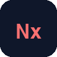

# Magrathean UK

Practical AI adoption, Microsoft 365 cleanup, security work, and shipped software.

Magrathean UK builds small, direct systems for teams that need useful AI, cleaner Microsoft 365 estates, local-first apps, and operator-owned infrastructure. The public work here is the visible edge of a wider product stack across Apple platforms, Android, Linux operations, tenant audit evidence, App Store automation, and local-first data workflows.

## Company

- [Magrathean UK](https://magrathean.uk) - company site and software catalogue.
- [AI Adoption](https://magrathean.uk/ai/) - repo-aware and terminal-aware agent workflows for real teams.
- [IT Consultancy](https://magrathean.uk/it/) - Microsoft 365 security cleanup, identity, devices, endpoint control, and Cyber Essentials Plus readiness.
- [Contact](https://magrathean.uk/contact/) - direct project and consultancy enquiries.

## Product Sites

-  **[Auditex](https://auditex.hu)** - open-source Python CLI and MCP toolkit for local Microsoft 365 and Google Workspace tenant audit evidence. [Source](https://github.com/magrathean-uk/auditex) / [site repo](https://github.com/magrathean-uk/auditex.hu)
-  **[Codexex](https://codexex.eu)** - Codex and Spark quota tracking on Mac, iPhone, and iPad. [Source](https://github.com/magrathean-uk/Codexex) / [site repo](https://github.com/magrathean-uk/codexex.eu)
-  **[Teslatlas](https://teslatlas.eu)** - local-first TeslaMate analytics, route replay, charge diagnostics, and battery insight. [Source](https://github.com/magrathean-uk/teslatlas) / [site repo](https://github.com/magrathean-uk/teslatlas.eu)
-  **[Termex](https://termexapp.eu)** - tmux-backed SSH, SFTP transfer, jump hosts, port forwarding, and session continuity. [Source](https://github.com/magrathean-uk/Termex) / [site repo](https://github.com/magrathean-uk/termexapp.eu)
-  **[Nodex](https://nodexapp.eu)** - Linux host monitoring over SSH for metrics, services, containers, alerts, and local history. [Source](https://github.com/magrathean-uk/Nodex) / [site repo](https://github.com/magrathean-uk/nodexapp.eu)

## Apps And Product Work

-  **Finex UK** (`finexUK`) - offline UK benefit and tax estimation with local rules, LHA lookup, and privacy-first storage.
-  **Capturex** - local-network multi-device camera recording for iOS and macOS with coordinated capture and local relay work.
-  **FindR** - macOS investigation tooling for profile search, match scoring, local storage, and export flows.
-  **Newsex** - Debian signal desk for fetching, clustering, scoring, rendering, and sending operational news digests.
-  **ViceDen** - Rust forum system with server-rendered UI, JSON API, Postgres support, moderation, notifications, and local fallback.
-  **Stockex** - market and finance workflow tooling.
-  **QuillAtlas** - curated local directory and review data pipeline for England.
-  **Trendcraft** - trend and publishing tooling.
-  **XauEx** - gold and market signal tooling.

## Public Code

-  [auditex](https://github.com/magrathean-uk/auditex) - open-source local tenant audit evidence toolkit.
-  [Codexex](https://github.com/magrathean-uk/Codexex) - macOS and iOS Codex quota companion with helper-based sign-in and local usage history.
-  [Teslatlas](https://github.com/magrathean-uk/teslatlas) - local-first TeslaMate analytics with SwiftUI and Rust data work.
-  [Termex](https://github.com/magrathean-uk/Termex) - iOS SSH client with tmux continuity, SFTP, jump hosts, and port forwarding.
-  [Nodex](https://github.com/magrathean-uk/Nodex) - iOS Linux server monitoring and operational controls over SSH.
-  [Teslacam](https://github.com/magrathean-uk/Teslacam) - native macOS app and Python CLI for browsing and exporting TeslaCam footage.
-  [asc-cli](https://github.com/magrathean-uk/asc-cli) - App Store Connect from the terminal and from agents.
-  [asc-screens](https://github.com/magrathean-uk/asc-screens) - prompt-driven CLI for App Store Connect screenshots from iPhone and iPad captures.
-  [hostmap](https://github.com/magrathean-uk/hostmap) - public host mapping utility work.
-  [rustic](https://github.com/magrathean-uk/rustic) - fast, encrypted, deduplicated backup tooling.
-  [Teslatlas-Android](https://github.com/magrathean-uk/Teslatlas-Android) - Android companion work for TeslaMate analytics.
-  [Termex-Android](https://github.com/magrathean-uk/Termex-Android) - Android SSH client work around terminal-first server access.
-  [Nodex-Android](https://github.com/magrathean-uk/Nodex-Android) - Android Linux server monitoring over SSH.

## Site Repositories

-  [auditex.hu](https://github.com/magrathean-uk/auditex.hu) - static site for [auditex.hu](https://auditex.hu).
-  [codexex.eu](https://github.com/magrathean-uk/codexex.eu) - static site for [codexex.eu](https://codexex.eu).
-  [teslatlas.eu](https://github.com/magrathean-uk/teslatlas.eu) - static site for [teslatlas.eu](https://teslatlas.eu).
-  [termexapp.eu](https://github.com/magrathean-uk/termexapp.eu) - static site for [termexapp.eu](https://termexapp.eu).
-  [nodexapp.eu](https://github.com/magrathean-uk/nodexapp.eu) - static site for [nodexapp.eu](https://nodexapp.eu).

## Internal And Operations

-  **Magrathean site** - company site, IT pages, outreach tooling, and VPS deploy flow.
-  **quillatlas-api** - Rust and Axum read/write API for QuillAtlas.
-  **bolyki.eu** - GPU-rendered landing page and static deployment.
-  **vps** - server operations, deploy scripts, Docker services, nginx, backups, and monitoring.
-  **icons8-liquid-glass-pipeline** - icon processing and visual asset pipeline.

## Working Style

Ship useful systems, keep data close to the owner, prefer direct infrastructure over unnecessary control planes, and make AI workflows prove themselves against real repos, real commands, real tests, and real review.

## Legal

Copyright (c) 2026 Magrathean UK Ltd. All rights reserved.

This repository is the GitHub profile for Magrathean UK Ltd. The contents of this repository are proprietary; see [`LICENSE`](./LICENSE) for the full notice. Each individual product or codebase listed above is governed by its own licence - consult the `LICENSE` or `LICENSE.md` file in the relevant product repository.

"Magrathean", "Magrathean UK", "Teslatlas", "Termex", "Nodex", "Finex UK", "Capturex", "FindR", "Newsex", "ViceDen", "Teslacam", "Codexex", "Auditex", "QuillAtlas", "Trendcraft", "Stockex", and "XauEx" are trade marks or unregistered trade marks of Magrathean UK Ltd. and may not be used to imply affiliation, endorsement, or sponsorship without prior written permission. References on this profile to third-party trade marks (Apple, Microsoft, Tesla, OpenAI, Linux, Rust, and others) are for descriptive purposes only and remain the property of their respective owners. Magrathean UK Ltd. is not affiliated with, endorsed by, or sponsored by any of those third parties.

For licensing or commercial enquiries, email <contact@magrathean.uk>.

---

Magrathean UK Ltd. is a company registered in England and Wales (Company No. 16955343) with registered office at 16 Caledonian Court West Street, Watford, England, WD17 1RY.
