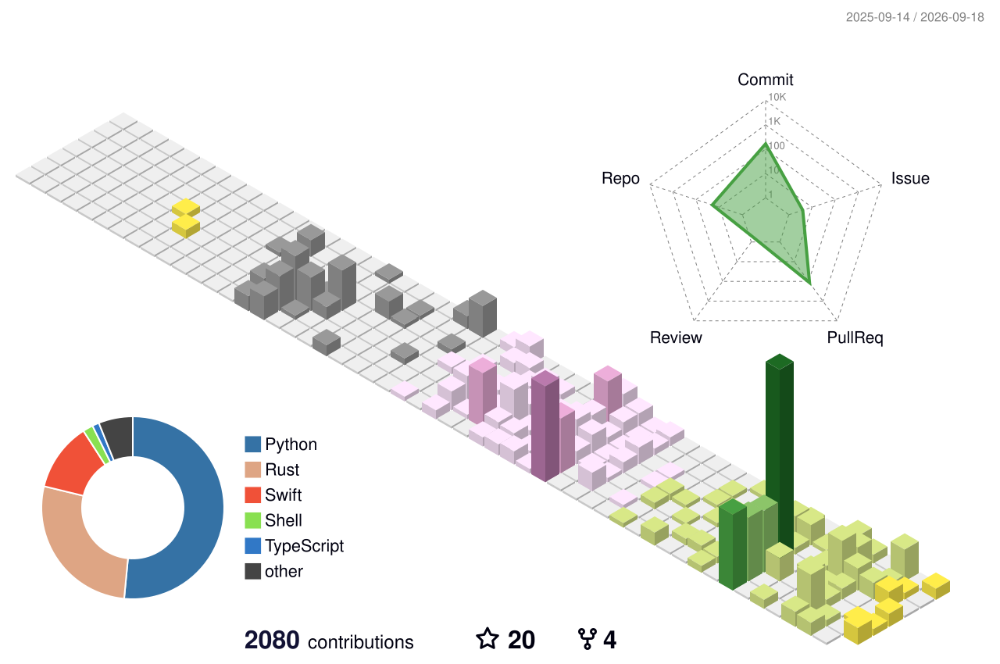

# Magrathean UK

Practical AI adoption, Microsoft 365 cleanup, security work, and shipped software.

Magrathean UK builds small, direct systems for teams that need useful AI, cleaner Microsoft 365 estates, local-first apps, and operator-owned infrastructure. The public work here is the visible edge of a wider product stack across Apple platforms, Linux operations, coding-agent tooling, tenant audit evidence, App Store automation, and local-first data workflows.

## Company

- [Magrathean UK](https://magrathean.uk) - company site and software catalogue.
- [AI Adoption](https://magrathean.uk/ai/) - repo-aware and terminal-aware agent workflows for real teams.
- [IT Consultancy](https://magrathean.uk/it/) - Microsoft 365 security cleanup, identity, devices, endpoint control, and Cyber Essentials Plus readiness.
- [Contact](https://magrathean.uk/contact/) - direct project and consultancy enquiries.

## Products

- **[Auditex](https://auditex.hu)** - open-source Python CLI and MCP toolkit for local Microsoft 365 and Google Workspace tenant audit evidence.
- **[Codexex](https://codexex.eu)** - Codex and Spark quota tracking on Mac, iPhone, and iPad.
- **[Teslatlas](https://github.com/magrathean-uk/teslatlas-app)** ([site](https://teslatlas.eu)) - an independent, local-first Apple app compatible with separately installed TeslaMate and MyTeslaMate data sources. It reads history without writing back or controlling the vehicle and is not affiliated with or endorsed by the TeslaMate project. Application source is not published.
- **[Termex](https://termexapp.eu)** - tmux-backed SSH, SFTP transfer, jump hosts, port forwarding, and session continuity.
- **[Nodex](https://nodexapp.eu)** - agentless Linux host monitoring over SSH for metrics, services, containers, alerts, and local history.

## Public Code

### Apps - macOS & iOS

- [Teslatlas](https://github.com/magrathean-uk/teslatlas-app) - public product page, privacy, terms, and support for the Teslatlas Apple app. Application source is not published.
- [Teslatlas Hub](https://github.com/magrathean-uk/teslatlas-hub) - self-hosted Tesla telemetry collector and local sync hub in Rust for macOS and Linux.
- [Teslacam](https://github.com/magrathean-uk/Teslacam) - native Apple app and cross-platform Python CLI for browsing and exporting TeslaCam footage.
- [Codexex](https://github.com/magrathean-uk/Codexex) - macOS and iOS companion for Codex quota tracking, with helper-based sign-in and local usage history.

### Coding-agent & developer tooling

- [asc-screens](https://github.com/magrathean-uk/asc-screens) - prompt-driven CLI for App Store Connect screenshots from iPhone and iPad captures.
- [icons8-nonapi-downloader](https://github.com/magrathean-uk/icons8-nonapi-downloader) - licensed account-holder workflow for mapping, downloading, recolouring, and rendering local Icons8 asset packs.

### Infrastructure, security & data

- [auditex](https://github.com/magrathean-uk/auditex) - open-source local tenant audit evidence toolkit for Microsoft 365 and Google Workspace.
- [hostmap](https://github.com/magrathean-uk/hostmap) - read-only Linux host architecture mapping, producing Markdown and JSON evidence for reviewers, operators, and AI agents.
- [unplugged-speaker](https://github.com/magrathean-uk/unplugged-speaker) - small macOS LaunchAgent that disconnects one Bluetooth speaker on battery power and reconnects it on AC.

### In development

- [BMW Atlas Hub](https://github.com/magrathean-uk/bmwatlas-hub) - design-stage, self-hosted BMW telemetry hub. The repository currently documents the intended boundary; it does not yet contain a runnable collector.

## Working Style

Ship useful systems, keep data close to the owner, prefer direct infrastructure over unnecessary control planes, and make AI workflows prove themselves against real repos, real commands, real tests, and real review.

## 📈 3D Contribution Graph

## Legal

Copyright (c) 2026 Magrathean UK Ltd. All rights reserved.

This repository is the GitHub profile for Magrathean UK Ltd. The contents of this repository are proprietary; see [`LICENSE`](./LICENSE) for the full notice. Each individual product or codebase listed above is governed by its own licence - consult the `LICENSE` or `LICENSE.md` file in the relevant product repository.

The Magrathean UK name and the product and project names shown on this profile are trade marks or unregistered trade marks of Magrathean UK Ltd. and may not be used to imply affiliation, endorsement, or sponsorship without prior written permission. References on this profile to third-party trade marks (Apple, Microsoft, Tesla, BMW, OpenAI, Linux, Rust, and others) are for descriptive purposes only and remain the property of their respective owners. Magrathean UK Ltd. is not affiliated with, endorsed by, or sponsored by any of those third parties.

For licensing or commercial enquiries, email <contact@magrathean.uk>.

---

Magrathean UK Ltd. is a company registered in England and Wales (Company No. 16955343) with registered office at 16 Caledonian Court West Street, Watford, England, WD17 1RY.
