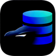
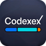
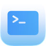

  

<h1 align="center">Magrathean</h1>

  Software for Apple platforms, Linux operations and developer workflows, 
  with AI adoption and Microsoft 365 security consultancy.

  <a href="https://magrathean.uk">magrathean.uk</a> ·
  <a href="https://github.com/magrathean-uk/.github/blob/main/LEGAL.md">Legal</a> ·
  <a href="https://magrathean.uk/privacy/">Privacy</a> ·
  <a href="mailto:contact@magrathean.uk">contact@magrathean.uk</a>

## Teslatlas

A private, local-first way to keep your Tesla's drives, charging and maps on your own devices.

| | Project | What it is | Licence |
| :---: | --- | --- | --- |
|  | [Teslatlas](https://teslatlas.eu) | iPhone, iPad and Mac app for your drives, charging and maps | Proprietary |
| | [Teslatlas Hub](https://github.com/magrathean-uk/teslatlas-hub) | Self-hosted collector and sync hub for macOS and Debian | AGPL-3.0 |
| | [Teslatlas Edge](https://github.com/magrathean-uk/teslatlas-edge) | Fleet Telemetry receiver you run for your Hub | AGPL-3.0 |
| | [Teslatlas Protocol](https://github.com/magrathean-uk/teslatlas-protocol) | Public contracts, schemas and fixtures | Apache-2.0 |
| | [Teslatlas Compute](https://github.com/magrathean-uk/teslatlas-compute) | Shared Rust kernel for map-tile computation | Apache-2.0 |
| | [Swift SDK](https://github.com/magrathean-uk/teslatlas-sdk-swift) · [TypeScript SDK](https://github.com/magrathean-uk/teslatlas-sdk-typescript) | Client libraries for the Hub protocol | Apache-2.0 |
| | [Teslatlas Viewer](https://github.com/magrathean-uk/teslatlas-viewer) | Minimal reference client | Apache-2.0 |
| | [Home Assistant](https://github.com/magrathean-uk/teslatlas-home-assistant) | Home Assistant integration for the Hub | Apache-2.0 |

## Apps

| | App | What it does | Licence |
| :---: | --- | --- | --- |
|  | [Codexex](https://codexex.eu) | Codex quota tracking and usage history on Apple devices | Proprietary |
|  | [Termex](https://termexapp.eu) | SSH client with tmux sessions, SFTP, jump hosts and port forwarding | Proprietary |
|  | [Nodex](https://nodexapp.eu) | Agentless Linux host monitoring over SSH | Proprietary |
|  | [Teslacam](https://teslacam.eu) | Browse and export dashcam and Sentry footage | Proprietary |
|  | [Auditex](https://auditex.hu) | Local Microsoft 365 and Google Workspace audit evidence | Apache-2.0 |
| | [Foldnex](https://github.com/magrathean-uk/foldnex) | Chrome extension that removes duplicate tabs and groups the rest | MIT |

## Developer tools

| | Tool | What it does | Licence |
| :---: | --- | --- | --- |
|  | [asc-screens](https://github.com/magrathean-uk/asc-screens) | App Store Connect screenshots from iPhone and iPad captures | MIT |
|  | [hostmap](https://github.com/magrathean-uk/hostmap) | Read-only architecture and evidence mapping for Linux hosts | MIT |
| | [clean-development](https://github.com/magrathean-uk/clean-development) | Keeps build output and caches outside project folders | MIT |
| | [srt-transcribe](https://github.com/magrathean-uk/srt-transcribe) | English subtitles from media files | MIT |
| | [uncordex](https://github.com/magrathean-uk/uncordex) | Disconnect and restore a Bluetooth speaker with a saved Mac desk setup | MIT |
| | [icons8-nonapi-downloader](https://github.com/magrathean-uk/icons8-nonapi-downloader) | Unofficial Icons8 asset-pack pipeline | MIT |
|  | [xauex](https://github.com/magrathean-uk/xauex) | Gold signal runtime with risk gates and a demo-execution dashboard | Proprietary |
| | [bmwatlas Hub](https://github.com/magrathean-uk/bmwatlas-hub) | Design-stage self-hosted BMW telemetry hub | AGPL-3.0 |

Contribution graph

---

MAGRATHEAN UK LTD · company number 16955343 · England and Wales.
Teslatlas and Teslacam are independent and are not affiliated with Tesla, Inc.; bmwatlas Hub
is not affiliated with BMW AG. See the <a href="https://github.com/magrathean-uk/.github/blob/main/LEGAL.md">legal notice</a>.
Corrections: <a href=".github/CONTRIBUTING.md">contributing</a> ·
<a href=".github/SECURITY.md">security</a> · <a href=".github/SUPPORT.md">support</a>.

