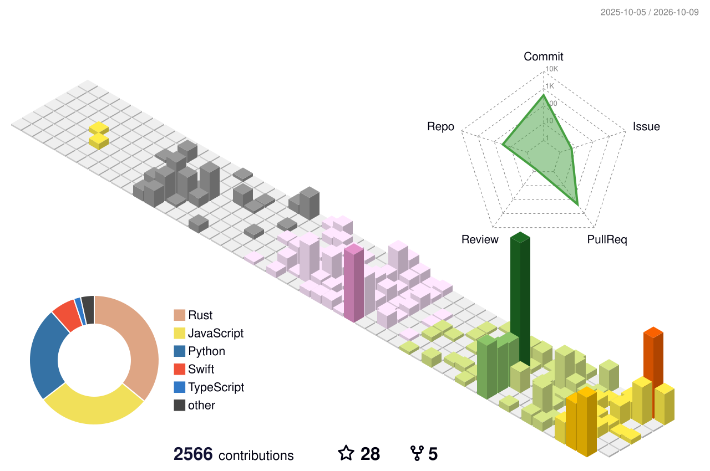

# Magrathean UK

AI adoption, Microsoft 365 security, and software for Apple platforms, Linux operations, and developer workflows.

## Company

- [Magrathean UK](https://magrathean.uk) - company site and software catalogue.
- [AI Adoption](https://magrathean.uk/ai/) - AI adoption services for teams.
- [IT Consultancy](https://magrathean.uk/it/) - Microsoft 365 security and IT consultancy.
- [Contact](https://magrathean.uk/contact/) - direct project and consultancy enquiries.

## Products

- **[Auditex](https://auditex.hu)** - open-source Python CLI and MCP toolkit for local Microsoft 365 and Google Workspace tenant audit evidence.
- **[Codexex](https://codexex.eu)** - Codex quota tracking and usage history for Apple devices.
- **[Teslatlas](https://github.com/magrathean-uk/teslatlas-app)** ([site](https://teslatlas.eu)) - an independent, local-first Apple app compatible with separately installed TeslaMate and MyTeslaMate data sources. It reads history without writing back or controlling the vehicle and is not affiliated with or endorsed by the TeslaMate project. Application source is not published.
- **[Termex](https://termexapp.eu)** - tmux-backed SSH, SFTP transfer, jump hosts, port forwarding, and session continuity.
- **[Nodex](https://nodexapp.eu)** - agentless Linux host monitoring over SSH for metrics, services, containers, alerts, and local history.

## Public repositories

Browse the projects below for their current status, source availability, licence, and support information.

### Profile and shared standards

- [.github](https://github.com/magrathean-uk/.github) - organization-wide community health, security policy, and governance standards.
- [magrathean-uk](https://github.com/magrathean-uk/magrathean-uk) - this profile and product index.

### Applications and developer tools

- [asc-screens](https://github.com/magrathean-uk/asc-screens) - prompt-driven CLI for App Store Connect screenshots from iPhone and iPad captures.
- [auditex](https://github.com/magrathean-uk/auditex) - open-source Python CLI and MCP toolkit for local Microsoft 365 and Google Workspace tenant audit evidence.
- [Codexex](https://github.com/magrathean-uk/Codexex) - macOS and iOS Codex quota companion with helper-based sign-in and local usage history.
- [clean-development](https://github.com/magrathean-uk/clean-development) - managed development caches and supported build output.
- [foldnex](https://github.com/magrathean-uk/foldnex) - Chrome extension for removing duplicate pages and organising tabs into groups.
- [hostmap](https://github.com/magrathean-uk/hostmap) - safe, read-only architecture and evidence mapping for Linux hosts.
- [icons8-nonapi-downloader](https://github.com/magrathean-uk/icons8-nonapi-downloader) - local Icons8 asset-pack mapping, downloading, recolouring, and rendering pipeline.
- [srt-transcribe](https://github.com/magrathean-uk/srt-transcribe) - English SRT subtitle generation from media using OpenAI transcription.
- [Tescam](https://github.com/magrathean-uk/Tescam) - Apple app and Python CLI for reviewing and exporting TeslaCam footage.
- [uncordex](https://github.com/magrathean-uk/uncordex) - native macOS control for disconnecting and restoring a Bluetooth speaker with a saved desk setup.
- [xauex](https://github.com/magrathean-uk/xauex) - XAUUSD signal and cTrader demo-execution runtime with risk gates, evidence, and operator dashboard.

### Teslatlas ecosystem

- [teslatlas-app](https://github.com/magrathean-uk/teslatlas-app) - public product page, privacy, terms, and support for the Teslatlas Apple app; application source is not published.
- [teslatlas-edge](https://github.com/magrathean-uk/teslatlas-edge) - user-operated Fleet Telemetry ingress for Teslatlas Hub.
- [teslatlas-home-assistant](https://github.com/magrathean-uk/teslatlas-home-assistant) - Home Assistant integration for the public Teslatlas Hub protocol.
- [teslatlas-hub](https://github.com/magrathean-uk/teslatlas-hub) - self-hosted multi-vehicle Tesla telemetry collector and local sync hub for macOS and Debian.
- [teslatlas-protocol](https://github.com/magrathean-uk/teslatlas-protocol) - public protocol contracts, schemas, fixtures, and compatibility rules.
- [teslatlas-sdk-swift](https://github.com/magrathean-uk/teslatlas-sdk-swift) - Swift client SDK for the public Teslatlas Hub protocol.
- [teslatlas-sdk-typescript](https://github.com/magrathean-uk/teslatlas-sdk-typescript) - TypeScript client SDK for the public Teslatlas Hub protocol.
- [teslatlas-viewer](https://github.com/magrathean-uk/teslatlas-viewer) - minimal reference client for the public Teslatlas Hub protocol.

### BMW

- [bmwatlas-hub](https://github.com/magrathean-uk/bmwatlas-hub) - design-stage, self-hosted BMW telemetry hub; the repository documents the intended boundary and does not yet contain a runnable collector.

## Profile maintenance

For corrections to this page, see [Contributing](CONTRIBUTING.md). For product help or enquiries, see [Support](SUPPORT.md). Report sensitive security concerns through [Security](SECURITY.md).

## Contribution graph

## Legal

Copyright (c) 2026 Magrathean UK Ltd. All rights reserved.

This repository is the GitHub profile for Magrathean UK Ltd. The contents of this repository are proprietary; see [`LICENSE`](./LICENSE) for the full notice. Each individual product or codebase listed above is governed by its own licence - consult the `LICENSE` or `LICENSE.md` file in the relevant product repository.

The Magrathean UK name and the product and project names shown on this profile are trade marks or unregistered trade marks of Magrathean UK Ltd. and may not be used to imply affiliation, endorsement, or sponsorship without prior written permission. References on this profile to third-party trade marks (Apple, Microsoft, Tesla, BMW, OpenAI, Linux, Rust, and others) are for descriptive purposes only and remain the property of their respective owners. Magrathean UK Ltd. is not affiliated with, endorsed by, or sponsored by any of those third parties.

For licensing or commercial enquiries, email <contact@magrathean.uk>.

---

Magrathean UK Ltd. is a company registered in England and Wales (Company No. 16955343) with registered office at 16 Caledonian Court West Street, Watford, England, WD17 1RY.
